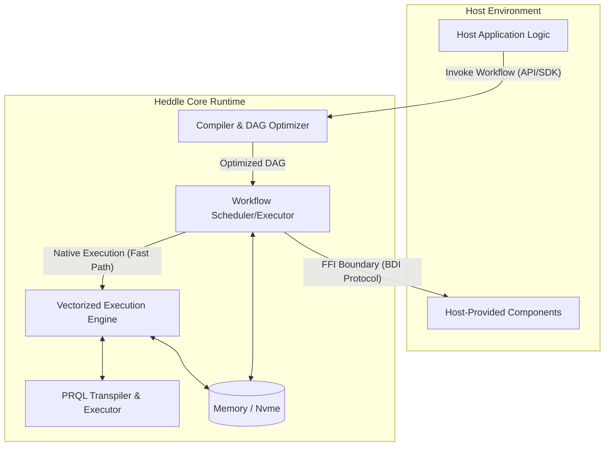

# Heddle Language

## Part 1: The User's Guide (What & How)

### 1\. Introduction

#### 1.1. Overview

Heddle is a statically-typed, declarative, data-flow orchestration language engineered for constructing high-throughput, resilient data integration and processing pipelines. It provides a specialized Domain-Specific Language (DSL) for composing heterogeneous components into coherent execution graphs. Heddle's architecture is predicated on a high-performance, in-memory columnar data format, ensuring efficiency, type safety, and optimized execution.

#### 1.2. Heddle by Example: A First Workflow

Before diving into the specification, let's look at a complete, simple Heddle workflow. This example fetches a list of users, filters for active users, and selects just their names and emails.

```heddle
import "io/http" as http
import "core/transform" as transform
import "core/log" as log

// 1. Define the shape of our data (Schema)
schema User = {
    id: int,
    name: string,
    email: string,
    active: bool
}

schema UserOutput = {
    name: string,
    email: string
}

// 2. Define the steps (Components)
step fetch_users -> User = http.get {
    url: "https://api.example.com/users"
}

step filter_active (User) -> User = transform.filter {
    condition: "active == true"
}

// 3. Define the main workflow
workflow process_users {
    fetch_users
        | filter_active
        | ( // 4. Use PRQL for data transformation
            from input
            select name, email
          ) -> UserOutput
        | log.info // (Assumes 'log.info' step is defined)

    fetch_users
        | ( // 5. Use PRQL for data transformation and filter
            from input
            select name, email
            where active = true
          ) -> UserOutput
        | log.info // (Assumes 'log.info' step is defined)
}
```

This example shows the four core concepts you'll use:

1.  **`schema`**: Defining the shape of your data.
2.  **`step`**: Defining a configured, reusable action.
3.  **`workflow`**: Naming the execution and defining the flow.
4.  **`|` (pipe)**: Chaining steps together to pass data.

#### 1.3. Design Tenets

Heddle is governed by the following architectural principles:

1.  **Declarative Orchestration**: Heddle emphasizes the definition of data dependencies (the "what") over imperative control flow (the "how").
2.  **Columnar-Native Execution**: The Heddle type system and runtime are optimized for processing columnar and unstructured data. This design facilitates vectorized execution (SIMD optimization).
3.  **Embedded Core Architecture**: Heddle is designed as an embeddable execution engine, not a monolithic runtime. It integrates seamlessly with host environments (e.g., Python, Go, Rust).
4.  **Integrated Transformation**: Heddle natively incorporates PRQL (Pipelined Relational Query Language) for complex data shaping (e.g., joins, aggregations).

#### 1.4. Scope

Heddle is optimized for scenarios requiring high-performance orchestration of structured data, including ETL/ELT pipelines, real-time event stream processing, and backend service coordination.

#### 1.5. Terminology

| Term | Definition |
| :------- | :------ |
| Component  | An abstract, side-effecting function provided by a module (e.g., `http.get`). |
| Step  | A named, configured, immutable instance of a Component (e.g., `fetch_users`).  |
| Workflow | A namespaced execution boundary containing a collection of Steps. |
| Pipeline |  The explicit flow of data between Steps, defined using the `\|` operator. |
| Workflow Context | The runtime state that persists the output (a Frame) of every executed Step. |
| Host Language | The external environment (e.g., Python) in which the Heddle Runtime is embedded. |
| Heddle Core Runtime (HCR) | The execution engine responsible for running Heddle code. |

-----

### 2\. The Heddle Language (Core Syntax)

This section covers the fundamental syntax for writing Heddle code.

#### 2.1. Modules and Imports

Heddle employs a hierarchical module system. The `import` statement brings external modules into the current scope.

```heddle
// Syntax: import "<module_path>" [as <alias>]

import "io/http" as http
import "core/transform"
```

#### 2.2. Workflows

The `workflow` block defines a distinct execution boundary and a local namespace. It serves as the entry point for execution.

```heddle
workflow UserProcessingPipeline {
  // Step definitions and pipeline declarations
}
```

#### 2.3. Steps (Component Instantiation)

The `step` keyword declares a configured, immutable instance of a component. This is where you define *what* a piece of logic does.

```heddle
// Syntax: step <identifier> = <module>.<component> { <configuration_block> }

step fetch_users = http.get {
    url: "https://api.example.com/v1/users",
    headers: {
        "Authorization": "Bearer <token>"
    }
}
```

Steps can then be used inside a `workflow` to build a pipeline.

#### 2.4. The Pipeline Operator (`|`)

The pipeline operator (`|`) defines the primary synchronous data flow. It directs the output Frame of the left-hand side (LHS) expression to become the primary input Frame of the right-hand side (RHS) expression.

```heddle
workflow run_fetch {
    fetch_users | validate_schema | load_into_warehouse
}
```

-----

### 3\. The Type System (Core Data)

Heddle employs a strong, static type system to ensure data integrity. This system ensures compile-time verification of data contracts.

#### 3.1. Primitive Types

Primitive types represent fixed-size scalar values suitable for efficient columnar storage.

| Heddle Type    | Description      | Physical Representation (Default) |
| :-------       | :------          | :------ |
| `int`          | Signed integer   | `Int64` (Explicit `int8`, `int16`, `int32`, `int64` supported) |
| `unit`         | Unsigned integer | `UInt64` (Explicit `uint8`, `uint16`, `uint32`, `uint64` supported)
| `float`        | Floating-point number | `Float64` (Explicit `float32`, `float64` supported) |
| `string`       | Variable-length text |   UTF-8 encoded bytes |
| `bool`         | Boolean value | Packed bit array or Int8 equivalent |
| `timestamp`    | Date and time | Nanoseconds since epoch (with optional timezone metadata) |
| `date`         |  Calendar date | Days since epoch |
| `time`         | Time of day | Nanoseconds since midnight |
| `bytes`        | Raw binary data | Variable-length byte array |
| `ecimal<P, S>` | Fixed-precision decimal | `Decimal128` or `Decimal256` |

#### 3.2. Complex Types (Container Types)

Complex types allow for nested and hierarchical data structures.

| Heddle Type       | Description |
| :-------          | :------ |
| `list<T>`,        | An ordered, homogeneous sequence of elements of type T. |
| `map<K, V>`       | A collection of key-value pairs. Keys (K) must be a primitive, non-nullable type. |
| `{field: T, ...}` | A Struct (Record). An inline definition of a fixed, ordered collection of named fields. |

#### 3.3. Schema Declaration

The `schema` keyword defines a reusable type definition for a Frame structure (the "shape" of your dataframe).

```heddle
schema UserProfile = {
  user_id: int,
  username: string,
  metadata: {
      created_at: timestamp,
      tags: list<string>
  }
}
```

#### 3.4. Type Annotations and Static Analysis

`step` declarations can (and should) be annotated with input and output schemas to enforce type contracts.

```heddle
// Syntax: step <identifier> [ (<InputSchema>) ] -> <OutputSchema> = <module>.<component> { ... }

// Output annotation: Ensures http.get returns data conforming to UserProfile
step get_users -> UserProfile = http.get { ... }

// Input/Output annotation: Input acts as an assertion on data entering the step.
step calculate_scores (UserProfile) -> UserScore = transform.prql {
    query: "from input | derive score = metrics.login_count * 1.5"
}
```

The Heddle compiler verifies schema compatibility, preventing runtime failures due to incompatible data structures.

-----

### 4\. Building a Complete Workflow (Features)

Now we combine syntax and types with features to build robust pipelines.

#### 4.1. Data Transformation (PRQL Integration)

Heddle delegates complex relational data shaping to embedded PRQL blocks, denoted by parentheses `(...)`.

##### 4.1.1. Contextual Access in PRQL

PRQL blocks can access data in two ways:

1.  **Pipelined Input**: Data passed via `|` is accessed using the reserved `input` keyword.
2.  **Workflow Context**: Data from any other `step` is accessed by its name.

<!-- end list -->

```heddle
step users = db.query { sql: "SELECT * FROM users" }
step events = kafka.read { topic: "user_events" }

workflow user_analytics {
    // 'events' output is piped into the PRQL block as 'input'
    events | (
        # PRQL Block
        from input # Refers to the Frame piped from the 'events' step
        join users (user_id == id) # Refers to the Frame output of the 'users' step
        group {users.country} (
            aggregate {
                event_count = count
            }
        )
    ) | update_analytics_dashboard
}
```

The Heddle compiler analyzes these references to build the correct execution graph (DAG).

#### 4.2. Resilience: Error Handling

Heddle provides granular mechanisms for handling exceptions.

##### 4.2.1. Local Error Handling (Try-Catch Operator)

The `?` operator can be suffixed to a `step` invocation within a pipeline to intercept errors *from that specific invocation*.

```heddle
// Syntax: <step_invocation> ? <error_handler_step>

step process_data = external.api_call { ... }

// Define a step to handle the error
error log_and_swallow = error.log {
    message: "API call failed, continuing with empty data"
    output: [] // Returns an empty frame to continue the pipeline
}

workflow process {
    // If process_data fails, log_and_swallow is executed instead.
    process_data ? log_and_swallow | finalize
}
```

##### 4.2.2. Global Error Handlers

A workflow can define a global error handler (`? <handler>`) that intercepts any exceptions *not* handled by a local `?` operator.

```heddle
import "std/error" as error

error slack_alert = error.alert.slack { 
    message: "FATAL: MainPipeline failed"
    // No return, so the workflow terminates
}

// slack_alert is now the global handler for this workflow
workflow MainPipeline ? slack_alert {
    step_one | step_two | step_three
}
```

-----

## Part 2: The Implementer's Guide (How it Works)

-----

This part of the document details the internal architecture and runtime execution model of Heddle.

### 5\. Architecture and Execution Model

#### 5.1. Embedded Core Architecture

Heddle operates on a dual-environment model, strictly segregating the declarative orchestration layer (managed by the HCR) from the imperative execution layer (provided by the Host Language).



The HCR manages the workflow lifecycle, while the Host Environment invokes the HCR and provides implementations for external components.

#### 5.2. Execution Model (DAG)

A Heddle `workflow` is compiled into a Directed Acyclic Graph (DAG). Nodes represent Steps, and edges represent data dependencies. The HCR executes the DAG by performing a topological sort and scheduling nodes for execution concurrently as their dependencies are satisfied.

#### 5.3. Workflow Context and Non-Linear Flows

The **Workflow Context** is an immutable, append-only key-value store. When a `step` executes, its output (a Frame) is persisted in the Workflow Context, indexed by the step's identifier. This mechanism enables subsequent steps to reference the results of any previously executed step, facilitating complex, non-linear execution topologies (e.g., fan-out/fan-in).

#### 5.4. Performance Model (Dual Path Execution)

Heddle optimizes execution by maximizing operations within the HCR.

1.  **Fast Path (Vectorized Execution)**: Operations executed entirely within the HCR (e.g., PRQL, built-in modules). These leverage the columnar format and vectorized processing (SIMD).
2.  **Slow Path (Host Interop)**: Execution that requires calling back into the Host Environment (the "Imperative Escape Hatch").

-----

### 6\. Advanced Runtime Features

#### 6.1. Compilation and Optimization

The HCR compiles Heddle source code into an optimized execution DAG. Key optimization strategies include:

  * **Operator Fusion**: Combining multiple sequential operations (e.g., adjacent filters) into a single execution unit to minimize intermediate data materialization.
  * **Predicate/Projection Pushdown**: Pushing filtering (predicates) and column selection (projections) as close to the data source as possible.
  * **Automatic Parallelization**: Analyzing the DAG to identify independent branches that can be executed concurrently.

#### 6.2. Memory Management and Spilling (Out-of-Core Execution)

To ensure robustness when processing datasets that exceed available RAM, the HCR employs:

  * **Buffer Pooling**: Minimizing memory allocation overhead by reusing standardized memory buffers.
  * **Data Spilling**: Transparently moving intermediate Frames from RAM to fast local storage (e.g., NVMe SSD) when memory pressure is high.

-----

### 7\. Observability

#### 7.1. Execution Modes

  * **Production Mode (Default)**: Prioritizes maximum throughput. The compiler applies aggressive optimizations. Intermediate states may be ephemeral.
  * **Debug Mode**: Prioritizes observability. Operator fusion is disabled. The runtime guarantees intermediate states are materialized and preserved in the Workflow Context.

#### 7.2. Introspection API

When in Debug Mode, the HCR exposes an Introspection API (via the Host SDK) that allows tools to:

1.  Inspect the compiled DAG.
2.  Set breakpoints on steps.
3.  Query the Workflow Context to view the exact Frame state at any point.
4.  Trace data lineage.

### 8\. Ecosystem

#### 8.1. Ecosystem and Roadmap

  * **Package Management**: Development of a package manager for distributing Heddle modules and schemas.
  * **Runtime Implementations and SDKs**:
      * **Tier 1 (Zero-Copy)**: Rust, C++, Go, Python (with native extensions).
      * **Tier 2 (Wasm/Serialization)**: Node.js/TypeScript, Java/JVM.
  * **Core Module Expansion**: Development of a `stdlib` for databases (PostgreSQL, ClickHouse), messaging (Kafka, NATS), and file formats (Parquet, Avro).

#### 8.2. AI-Powered Tooling

The declarative, strongly-typed nature of Heddle makes it an ideal Intermediate Representation (IR) for generative AI tooling, facilitating LLM-powered code generation and optimization.

#### 8.3. Research and Collaboration

Heddle invites community and academic collaboration, particularly in areas such as advanced compiler optimizations, cost-based optimization, and formalizing the type and effect systems.